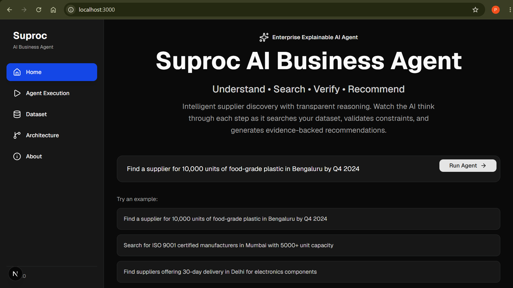
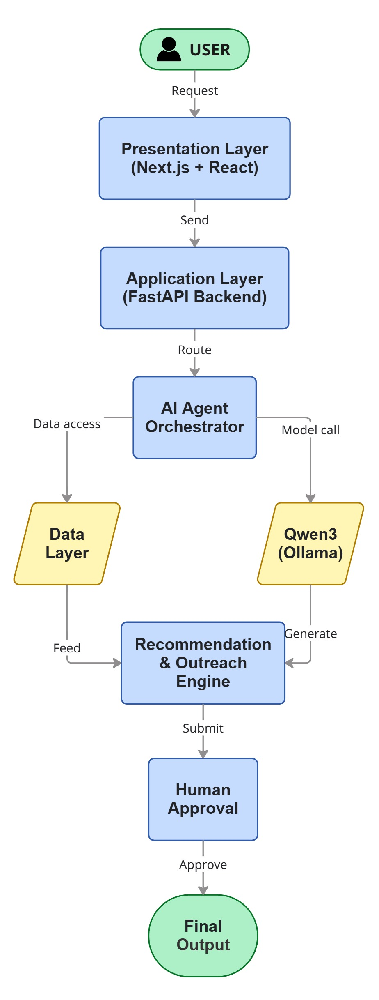
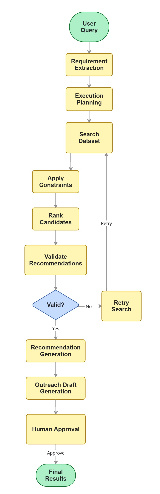
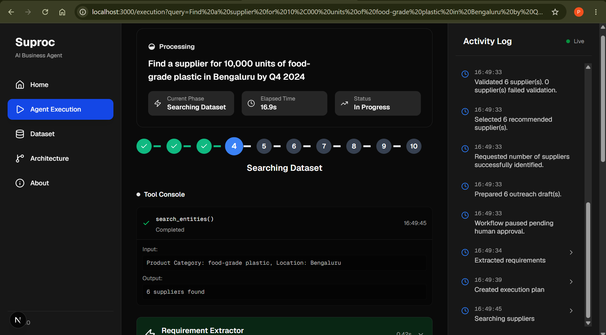
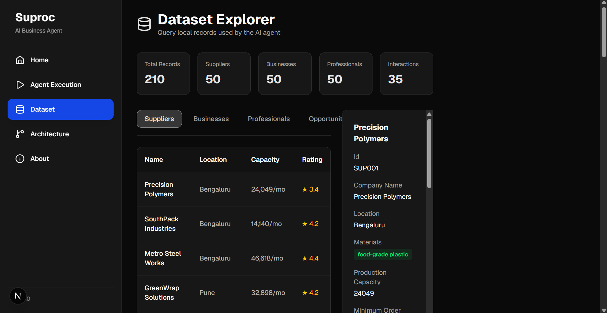
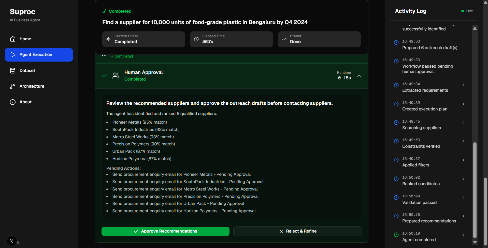
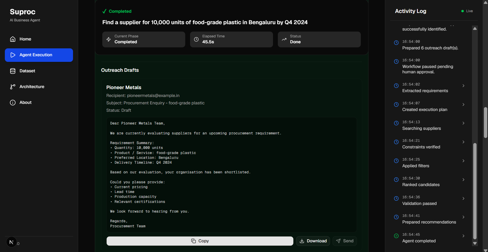

# 🚀 Suproc AI Business Agent

<p align="center">

### Local Agentic Search, Matching & Verification System

Built using **Qwen3 • Ollama • FastAPI • Next.js • React • TypeScript**

</p>

---



---

## 📖 About the Project

Suproc AI Business Agent is an explainable AI procurement assistant that understands procurement requirements expressed in natural language and executes a transparent multi-stage reasoning pipeline to identify suitable procurement entities from local datasets.

Unlike a traditional chatbot, the system performs structured reasoning through requirement extraction, planning, search, validation, recommendation generation, outreach drafting, and human approval before any external action.

---

# ✨ Features

- 🧠 AI-powered requirement extraction using **Qwen3**
- 🔍 Local procurement dataset search
- ⚙️ Explainable multi-stage reasoning pipeline
- ✅ Constraint filtering & validation
- 📊 Transparent recommendation engine
- 📧 Outreach draft generation
- 👨‍💼 Human approval workflow
- 📈 Interactive execution dashboard

---

# 💻 Technology Stack

| Layer | Technology |
|--------|------------|
| Frontend | Next.js, React, TypeScript |
| Backend | FastAPI, Python |
| AI | Ollama + Qwen3 |
| UI | Tailwind CSS, shadcn/ui |
| Data | Local JSON Datasets |

---

# 📁 Project Structure

```text
Suproc/
│
├── backend/
│   ├── engine/
│   ├── services/
│   ├── data/
│   └── app.py
│
├── frontend/
│   ├── app/
│   ├── components/
│   └── lib/
│
├── docs/
│   ├── architecture.md
│   ├── workflow.md
│   ├── assignment-checklist.md
│   └── images/
│
├── README.md
└── requirements.txt
```

---

# 🏗️ System Architecture

The application follows a modular agent architecture where each stage performs a single responsibility before passing its output to the next stage.

<p align="center">
  
</p>

---

# 🔄 AI Agent Workflow

Every request follows an explainable execution pipeline.

<p align="center">
  
</p>

| Stage | Purpose |
|--------|---------|
| Requirement Extraction | Convert natural language into structured requirements |
| Planning | Generate execution strategy |
| Search | Retrieve matching entities from local datasets |
| Constraint Filtering | Apply procurement constraints |
| Ranking | Score candidate entities |
| Validation | Verify recommendation quality |
| Retry Evaluation | Handle validation failures |
| Recommendation | Produce ranked recommendations |
| Outreach Draft | Prepare procurement enquiry drafts |
| Human Approval | Wait for user approval before external actions |

---

# ⚙️ Installation

## Clone Repository

```bash
git clone <repository-url>
cd suproc
```

## Backend

```bash
cd backend

python -m venv .venv

# Windows
.venv\Scripts\activate

# Linux / macOS
source .venv/bin/activate

pip install -r requirements.txt
```

## Install Ollama

```bash
ollama pull qwen3:4b

ollama serve
```

## Run Backend

```bash
uvicorn app:app --reload --app-dir backend
```

Backend API

```
http://localhost:8000
```

Swagger

```
http://localhost:8000/docs
```

## Frontend

```bash
cd frontend

npm install

npm run dev
```

Frontend

```
http://localhost:3000
```

---

# ▶️ Running the Application

Start the services in the following order:

1. Start Ollama
2. Start the FastAPI backend
3. Start the Next.js frontend
4. Open **http://localhost:3000**
5. Enter a procurement query
6. Click **Run Agent**
7. Review recommendations
8. Approve or reject outreach drafts

---

# 📸 Application Screenshots

## 🏠 Home Dashboard

Enter procurement requirements using natural language and launch the AI agent.


---

## ⚡ Agent Execution

Monitor the complete reasoning process through the execution timeline, activity log, tool console, validation status, and runtime metrics.



---

## 📂 Dataset Explorer

Browse the local procurement datasets used by the AI agent.



---

## ✅ Human Approval

Review recommendations and approve or reject outreach drafts before any external communication.



---

## 📧 Outreach Draft Generation

Automatically generated procurement enquiry drafts for shortlisted recommendations.



---

# 🛡 Validation & Reliability

The agent incorporates multiple mechanisms to improve reliability and explainability throughout execution.

- ✅ Natural language requirement extraction
- ✅ Deterministic fallback when LLM extraction fails
- ✅ Constraint filtering before recommendation
- ✅ Recommendation validation
- ✅ Retry evaluation for unsuccessful searches
- ✅ Human approval before external actions
- ✅ Complete execution logs for transparency

---

# 🧩 AI Agent Modules

| Module | Responsibility |
|---------|----------------|
| Requirement Extraction | Understands user intent and extracts structured procurement requirements |
| Planning Engine | Generates the execution strategy |
| Search Engine | Retrieves relevant records from local datasets |
| Constraint Filtering | Applies procurement constraints |
| Ranking Engine | Scores candidate entities |
| Validation Engine | Verifies recommendation quality |
| Retry Evaluation | Determines whether another search should be attempted |
| Recommendation Engine | Produces ranked recommendations |
| Outreach Engine | Generates procurement enquiry drafts |
| Human Approval | Waits for explicit user approval before external actions |

---

# 🔧 Tool Summary

| Tool | Purpose |
|------|---------|
| **search_entities()** | Search local procurement datasets |
| **filter_by_constraints()** | Apply procurement constraints |
| **calculate_match_score()** | Rank candidate entities |
| **validate_recommendations()** | Validate recommendation quality |
| **generate_outreach()** | Generate outreach drafts |
| **prepare_human_approval()** | Manage approval workflow |

---

# 💬 Example Queries

```text
Find food-grade plastic suppliers in Bengaluru capable of supplying 10,000 units by Q4 2024.
```

```text
Search for ISO 9001 certified manufacturers in Mumbai with 5000+ unit capacity.
```

```text
Find electronics suppliers in Delhi offering delivery within 30 days.
```

```text
Find pharmaceutical packaging suppliers with GMP certification.
```

---

# 📊 Example Agent Output

Each execution produces:

- Structured procurement requirements
- Execution plan
- Matching candidate entities
- Constraint validation results
- Ranked recommendations
- Outreach draft messages
- Human approval actions
- Activity timeline
- Runtime statistics
- Complete execution trace

---

# 📈 Engineering Highlights

### Explainable AI

Every stage of the agent pipeline exposes its reasoning, intermediate outputs, execution status, and runtime.

### Grounded Recommendations

Recommendations are generated using structured local procurement datasets rather than free-form LLM responses.

### Human-in-the-Loop

The system never performs external actions automatically. Outreach drafts require explicit user approval.

### Modular Architecture

Each stage of the pipeline is implemented as an independent engine, making the system maintainable and extensible.

### Local Execution

The complete application—including the AI model—runs locally using Ollama and FastAPI without requiring external AI services.

---

# 📚 Documentation

Additional project documentation is available in the **docs/** directory.

- 📖 **architecture.md** — System architecture and design decisions
- 🔄 **workflow.md** — End-to-end AI agent workflow
- ✅ **assignment-checklist.md** — Assignment requirement mapping

---

# 🚀 Future Enhancements

- Semantic vector search
- Hybrid retrieval (keywords + embeddings)
- Knowledge graph integration
- Enterprise database connectivity
- Multi-agent collaboration
- Cloud deployment

---

# 👩‍💻 Author

**Pooja A**

**Suproc AI Business Agent**

Developed as part of the **Suproc AI Engineering Assignment**.

---

## ⭐ Acknowledgements

This project demonstrates the application of **Agentic AI**, **Explainable AI**, and **Human-in-the-Loop** principles to support transparent procurement decision-making using a fully local AI stack.
